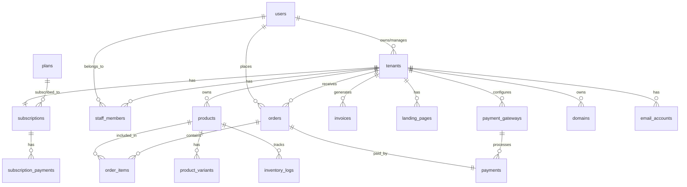

# Database Schema Design
## Multi-Tenant SaaS E-Commerce Platform

This document outlines the database structure for the MyPay SaaS platform.

---

## Entity Relationship Diagram



---

## Core Tables

### 1. users
Primary user table for all roles (SuperAdmin, Admin, Seller, Buyer)

| Column | Type | Constraints | Description |
|--------|------|-------------|-------------|
| id | BIGINT | PK, AUTO_INCREMENT | Primary key |
| name | VARCHAR(255) | NOT NULL | Full name |
| email | VARCHAR(255) | UNIQUE, NOT NULL | Email address |
| email_verified_at | TIMESTAMP | NULLABLE | Email verification timestamp |
| password | VARCHAR(255) | NOT NULL | Hashed password |
| role | ENUM | NOT NULL | 'superadmin', 'admin', 'seller', 'buyer' |
| tenant_id | BIGINT | NULLABLE, FK | Reference to tenant (for sellers/staff) |
| status | ENUM | DEFAULT 'active' | 'active', 'inactive', 'suspended' |
| phone | VARCHAR(20) | NULLABLE | Phone number |
| avatar | VARCHAR(255) | NULLABLE | Profile picture URL |
| remember_token | VARCHAR(100) | NULLABLE | Remember me token |
| created_at | TIMESTAMP | | Creation timestamp |
| updated_at | TIMESTAMP | | Last update timestamp |

**Indexes:**
- `idx_email` on `email`
- `idx_role` on `role`
- `idx_tenant_id` on `tenant_id`

---

### 2. tenants
Seller accounts (multi-tenant isolation)

| Column | Type | Constraints | Description |
|--------|------|-------------|-------------|
| id | BIGINT | PK, AUTO_INCREMENT | Primary key |
| owner_id | BIGINT | FK, NOT NULL | Reference to users table |
| business_name | VARCHAR(255) | NOT NULL | Business/store name |
| slug | VARCHAR(255) | UNIQUE, NOT NULL | URL-friendly identifier |
| description | TEXT | NULLABLE | Business description |
| logo | VARCHAR(255) | NULLABLE | Logo URL |
| whatsapp_number | VARCHAR(20) | NULLABLE | WhatsApp number for order notifications |
| status | ENUM | DEFAULT 'active' | 'active', 'inactive', 'suspended' |
| currency | VARCHAR(3) | DEFAULT 'MYR' | 'MYR', 'SGD', 'IDR', 'USD' |
| timezone | VARCHAR(50) | DEFAULT 'Asia/Kuala_Lumpur' | Timezone |
| settings | JSON | NULLABLE | Additional settings |
| created_at | TIMESTAMP | | Creation timestamp |
| updated_at | TIMESTAMP | | Last update timestamp |

**Indexes:**
- `idx_slug` on `slug`
- `idx_owner_id` on `owner_id`
- `idx_status` on `status`

---

### 3. plans
Subscription plans configuration

| Column | Type | Constraints | Description |
|--------|------|-------------|-------------|
| id | BIGINT | PK, AUTO_INCREMENT | Primary key |
| name | VARCHAR(100) | NOT NULL | Plan name (Free, Basic, Pro, Max) |
| slug | VARCHAR(100) | UNIQUE, NOT NULL | URL-friendly identifier |
| price | DECIMAL(10,2) | NOT NULL | Monthly price |
| currency | VARCHAR(3) | DEFAULT 'MYR' | Currency code |
| is_hidden | BOOLEAN | DEFAULT FALSE | Hidden/permanent plans |
| features | JSON | NOT NULL | Plan features and limits |
| status | ENUM | DEFAULT 'active' | 'active', 'inactive' |
| sort_order | INT | DEFAULT 0 | Display order |
| created_at | TIMESTAMP | | Creation timestamp |
| updated_at | TIMESTAMP | | Last update timestamp |

**Features JSON Structure:**
```json
{
  "landing_pages": 1,
  "max_products": 15,
  "whatsapp_integration": true,
  "email_blast_limit": 100,
  "user_logins": 1,
  "invoices_per_month": 10,
  "email_accounts": 1,
  "custom_domain": false,
  "social_media_ads": false,
  "seo_tools": true
}
```

---

### 4. subscriptions
Active subscriptions for tenants

| Column | Type | Constraints | Description |
|--------|------|-------------|-------------|
| id | BIGINT | PK, AUTO_INCREMENT | Primary key |
| tenant_id | BIGINT | FK, NOT NULL | Reference to tenants |
| plan_id | BIGINT | FK, NOT NULL | Reference to plans |
| status | ENUM | NOT NULL | 'active', 'cancelled', 'suspended', 'expired' |
| trial_ends_at | TIMESTAMP | NULLABLE | Trial period end date |
| current_period_start | TIMESTAMP | NOT NULL | Current billing period start |
| current_period_end | TIMESTAMP | NOT NULL | Current billing period end |
| cancel_at_period_end | BOOLEAN | DEFAULT FALSE | Cancel at end of period |
| cancelled_at | TIMESTAMP | NULLABLE | Cancellation timestamp |
| created_at | TIMESTAMP | | Creation timestamp |
| updated_at | TIMESTAMP | | Last update timestamp |

**Indexes:**
- `idx_tenant_id` on `tenant_id`
- `idx_status` on `status`
- `idx_current_period_end` on `current_period_end`

---

### 5. subscription_payments
Payment history for subscriptions

| Column | Type | Constraints | Description |
|--------|------|-------------|-------------|
| id | BIGINT | PK, AUTO_INCREMENT | Primary key |
| subscription_id | BIGINT | FK, NOT NULL | Reference to subscriptions |
| amount | DECIMAL(10,2) | NOT NULL | Payment amount |
| currency | VARCHAR(3) | NOT NULL | Currency code |
| status | ENUM | NOT NULL | 'pending', 'completed', 'failed', 'refunded' |
| payment_method | VARCHAR(50) | NULLABLE | Payment method used |
| transaction_id | VARCHAR(255) | NULLABLE | External transaction ID |
| paid_at | TIMESTAMP | NULLABLE | Payment completion timestamp |
| created_at | TIMESTAMP | | Creation timestamp |
| updated_at | TIMESTAMP | | Last update timestamp |

---

### 6. products
Product catalog for each tenant

| Column | Type | Constraints | Description |
|--------|------|-------------|-------------|
| id | BIGINT | PK, AUTO_INCREMENT | Primary key |
| tenant_id | BIGINT | FK, NOT NULL | Reference to tenants |
| name | VARCHAR(255) | NOT NULL | Product name |
| slug | VARCHAR(255) | NOT NULL | URL-friendly identifier |
| description | TEXT | NULLABLE | Product description |
| short_description | VARCHAR(500) | NULLABLE | Short description |
| price | DECIMAL(10,2) | NOT NULL | Product price |
| compare_price | DECIMAL(10,2) | NULLABLE | Original price (for discounts) |
| sku | VARCHAR(100) | NULLABLE | Stock Keeping Unit |
| barcode | VARCHAR(100) | NULLABLE | Product barcode |
| type | ENUM | DEFAULT 'physical' | 'physical', 'digital' |
| status | ENUM | DEFAULT 'draft' | 'draft', 'published', 'archived' |
| stock_quantity | INT | DEFAULT 0 | Current stock quantity |
| low_stock_threshold | INT | DEFAULT 5 | Low stock alert threshold |
| images | JSON | NULLABLE | Array of image URLs |
| seo_title | VARCHAR(255) | NULLABLE | SEO meta title |
| seo_description | VARCHAR(500) | NULLABLE | SEO meta description |
| created_at | TIMESTAMP | | Creation timestamp |
| updated_at | TIMESTAMP | | Last update timestamp |

**Indexes:**
- `idx_tenant_id` on `tenant_id`
- `idx_slug` on `slug`
- `idx_status` on `status`
- `idx_sku` on `sku`

---

### 7. product_variants
Product variations (size, color, etc.)

| Column | Type | Constraints | Description |
|--------|------|-------------|-------------|
| id | BIGINT | PK, AUTO_INCREMENT | Primary key |
| product_id | BIGINT | FK, NOT NULL | Reference to products |
| name | VARCHAR(255) | NOT NULL | Variant name (e.g., "Red - Large") |
| sku | VARCHAR(100) | NULLABLE | Variant SKU |
| price | DECIMAL(10,2) | NULLABLE | Variant price (overrides product price) |
| stock_quantity | INT | DEFAULT 0 | Variant stock |
| attributes | JSON | NOT NULL | Variant attributes |
| created_at | TIMESTAMP | | Creation timestamp |
| updated_at | TIMESTAMP | | Last update timestamp |

**Attributes JSON Structure:**
```json
{
  "color": "Red",
  "size": "Large"
}
```

---

### 8. orders
Customer orders

| Column | Type | Constraints | Description |
|--------|------|-------------|-------------|
| id | BIGINT | PK, AUTO_INCREMENT | Primary key |
| tenant_id | BIGINT | FK, NOT NULL | Reference to tenants |
| buyer_id | BIGINT | FK, NOT NULL | Reference to users (buyer) |
| order_number | VARCHAR(50) | UNIQUE, NOT NULL | Unique order number |
| status | ENUM | DEFAULT 'pending' | Order status |
| subtotal | DECIMAL(10,2) | NOT NULL | Subtotal amount |
| shipping_cost | DECIMAL(10,2) | DEFAULT 0 | Shipping cost |
| tax | DECIMAL(10,2) | DEFAULT 0 | Tax amount |
| total | DECIMAL(10,2) | NOT NULL | Total amount |
| currency | VARCHAR(3) | NOT NULL | Currency code |
| shipping_address | JSON | NOT NULL | Shipping address details |
| billing_address | JSON | NULLABLE | Billing address details |
| tracking_number | VARCHAR(255) | NULLABLE | Shipment tracking number |
| notes | TEXT | NULLABLE | Order notes |
| created_at | TIMESTAMP | | Creation timestamp |
| updated_at | TIMESTAMP | | Last update timestamp |

**Status Values:**
- 'pending_payment'
- 'payment_confirmed'
- 'processing'
- 'shipped'
- 'delivered'
- 'cancelled'
- 'refunded'

**Indexes:**
- `idx_tenant_id` on `tenant_id`
- `idx_buyer_id` on `buyer_id`
- `idx_order_number` on `order_number`
- `idx_status` on `status`

---

### 9. order_items
Items within an order

| Column | Type | Constraints | Description |
|--------|------|-------------|-------------|
| id | BIGINT | PK, AUTO_INCREMENT | Primary key |
| order_id | BIGINT | FK, NOT NULL | Reference to orders |
| product_id | BIGINT | FK, NOT NULL | Reference to products |
| variant_id | BIGINT | FK, NULLABLE | Reference to product_variants |
| product_name | VARCHAR(255) | NOT NULL | Product name snapshot |
| variant_name | VARCHAR(255) | NULLABLE | Variant name snapshot |
| quantity | INT | NOT NULL | Quantity ordered |
| price | DECIMAL(10,2) | NOT NULL | Price per unit |
| total | DECIMAL(10,2) | NOT NULL | Total for line item |
| created_at | TIMESTAMP | | Creation timestamp |
| updated_at | TIMESTAMP | | Last update timestamp |

---

### 10. payments
Payment transactions

| Column | Type | Constraints | Description |
|--------|------|-------------|-------------|
| id | BIGINT | PK, AUTO_INCREMENT | Primary key |
| order_id | BIGINT | FK, NOT NULL | Reference to orders |
| payment_gateway_id | BIGINT | FK, NOT NULL | Reference to payment_gateways |
| amount | DECIMAL(10,2) | NOT NULL | Payment amount |
| currency | VARCHAR(3) | NOT NULL | Currency code |
| status | ENUM | NOT NULL | 'pending', 'completed', 'failed', 'refunded' |
| transaction_id | VARCHAR(255) | NULLABLE | External transaction ID |
| payment_method | VARCHAR(50) | NULLABLE | Payment method |
| metadata | JSON | NULLABLE | Additional payment data |
| paid_at | TIMESTAMP | NULLABLE | Payment completion timestamp |
| created_at | TIMESTAMP | | Creation timestamp |
| updated_at | TIMESTAMP | | Last update timestamp |

---

### 11. invoices
Generated invoices

| Column | Type | Constraints | Description |
|--------|------|-------------|-------------|
| id | BIGINT | PK, AUTO_INCREMENT | Primary key |
| tenant_id | BIGINT | FK, NOT NULL | Reference to tenants |
| order_id | BIGINT | FK, NULLABLE | Reference to orders (if order-based) |
| invoice_number | VARCHAR(50) | UNIQUE, NOT NULL | Unique invoice number |
| customer_name | VARCHAR(255) | NOT NULL | Customer name |
| customer_email | VARCHAR(255) | NOT NULL | Customer email |
| customer_address | JSON | NULLABLE | Customer address |
| items | JSON | NOT NULL | Invoice line items |
| subtotal | DECIMAL(10,2) | NOT NULL | Subtotal amount |
| tax | DECIMAL(10,2) | DEFAULT 0 | Tax amount |
| total | DECIMAL(10,2) | NOT NULL | Total amount |
| currency | VARCHAR(3) | NOT NULL | Currency code |
| status | ENUM | DEFAULT 'unpaid' | 'unpaid', 'paid', 'cancelled' |
| due_date | DATE | NULLABLE | Payment due date |
| paid_at | TIMESTAMP | NULLABLE | Payment timestamp |
| notes | TEXT | NULLABLE | Invoice notes |
| created_at | TIMESTAMP | | Creation timestamp |
| updated_at | TIMESTAMP | | Last update timestamp |

---

### 12. payment_gateways
Payment gateway configurations per tenant

| Column | Type | Constraints | Description |
|--------|------|-------------|-------------|
| id | BIGINT | PK, AUTO_INCREMENT | Primary key |
| tenant_id | BIGINT | FK, NOT NULL | Reference to tenants |
| gateway | ENUM | NOT NULL | 'toyyibpay', 'billplz', 'chipin', 'paypal' |
| is_active | BOOLEAN | DEFAULT FALSE | Gateway active status |
| is_test_mode | BOOLEAN | DEFAULT TRUE | Test/sandbox mode |
| credentials | JSON | NOT NULL | Encrypted API credentials |
| settings | JSON | NULLABLE | Gateway-specific settings |
| created_at | TIMESTAMP | | Creation timestamp |
| updated_at | TIMESTAMP | | Last update timestamp |

**Credentials JSON Structure (encrypted):**
```json
{
  "api_key": "encrypted_key",
  "secret_key": "encrypted_secret",
  "merchant_id": "merchant_id"
}
```

---

### 13. landing_pages
Landing page configurations

| Column | Type | Constraints | Description |
|--------|------|-------------|-------------|
| id | BIGINT | PK, AUTO_INCREMENT | Primary key |
| tenant_id | BIGINT | FK, NOT NULL | Reference to tenants |
| title | VARCHAR(255) | NOT NULL | Page title |
| slug | VARCHAR(255) | NOT NULL | URL slug |
| template | VARCHAR(100) | NOT NULL | Template identifier |
| content | JSON | NOT NULL | Page content/sections |
| seo_title | VARCHAR(255) | NULLABLE | SEO meta title |
| seo_description | VARCHAR(500) | NULLABLE | SEO meta description |
| seo_keywords | VARCHAR(500) | NULLABLE | SEO keywords |
| custom_css | TEXT | NULLABLE | Custom CSS |
| custom_js | TEXT | NULLABLE | Custom JavaScript |
| is_published | BOOLEAN | DEFAULT FALSE | Published status |
| created_at | TIMESTAMP | | Creation timestamp |
| updated_at | TIMESTAMP | | Last update timestamp |

---

### 14. domains
Custom domain management

| Column | Type | Constraints | Description |
|--------|------|-------------|-------------|
| id | BIGINT | PK, AUTO_INCREMENT | Primary key |
| tenant_id | BIGINT | FK, NOT NULL | Reference to tenants |
| domain | VARCHAR(255) | UNIQUE, NOT NULL | Domain name |
| type | ENUM | NOT NULL | 'subdomain', 'custom' |
| is_verified | BOOLEAN | DEFAULT FALSE | DNS verification status |
| ssl_status | ENUM | DEFAULT 'pending' | 'pending', 'active', 'failed' |
| verification_token | VARCHAR(255) | NULLABLE | DNS verification token |
| verified_at | TIMESTAMP | NULLABLE | Verification timestamp |
| created_at | TIMESTAMP | | Creation timestamp |
| updated_at | TIMESTAMP | | Last update timestamp |

---

### 15. email_accounts
Email accounts under domain

| Column | Type | Constraints | Description |
|--------|------|-------------|-------------|
| id | BIGINT | PK, AUTO_INCREMENT | Primary key |
| tenant_id | BIGINT | FK, NOT NULL | Reference to tenants |
| domain_id | BIGINT | FK, NOT NULL | Reference to domains |
| email | VARCHAR(255) | UNIQUE, NOT NULL | Full email address |
| password | VARCHAR(255) | NOT NULL | Encrypted email password |
| quota_mb | INT | DEFAULT 1024 | Storage quota in MB |
| is_active | BOOLEAN | DEFAULT TRUE | Account active status |
| created_at | TIMESTAMP | | Creation timestamp |
| updated_at | TIMESTAMP | | Last update timestamp |

---

### 16. staff_members
Staff/team member management

| Column | Type | Constraints | Description |
|--------|------|-------------|-------------|
| id | BIGINT | PK, AUTO_INCREMENT | Primary key |
| tenant_id | BIGINT | FK, NOT NULL | Reference to tenants |
| user_id | BIGINT | FK, NOT NULL | Reference to users |
| role | ENUM | NOT NULL | 'owner', 'manager', 'staff' |
| permissions | JSON | NULLABLE | Custom permissions |
| is_active | BOOLEAN | DEFAULT TRUE | Active status |
| invited_at | TIMESTAMP | NULLABLE | Invitation timestamp |
| joined_at | TIMESTAMP | NULLABLE | Join timestamp |
| created_at | TIMESTAMP | | Creation timestamp |
| updated_at | TIMESTAMP | | Last update timestamp |

---

### 17. notifications
System notifications

| Column | Type | Constraints | Description |
|--------|------|-------------|-------------|
| id | BIGINT | PK, AUTO_INCREMENT | Primary key |
| user_id | BIGINT | FK, NOT NULL | Reference to users |
| type | VARCHAR(100) | NOT NULL | Notification type |
| title | VARCHAR(255) | NOT NULL | Notification title |
| message | TEXT | NOT NULL | Notification message |
| data | JSON | NULLABLE | Additional data |
| is_read | BOOLEAN | DEFAULT FALSE | Read status |
| read_at | TIMESTAMP | NULLABLE | Read timestamp |
| created_at | TIMESTAMP | | Creation timestamp |
| updated_at | TIMESTAMP | | Last update timestamp |

---

### 18. inventory_logs
Stock movement tracking

| Column | Type | Constraints | Description |
|--------|------|-------------|-------------|
| id | BIGINT | PK, AUTO_INCREMENT | Primary key |
| product_id | BIGINT | FK, NOT NULL | Reference to products |
| variant_id | BIGINT | FK, NULLABLE | Reference to product_variants |
| type | ENUM | NOT NULL | 'purchase', 'sale', 'adjustment', 'return' |
| quantity_change | INT | NOT NULL | Quantity change (+ or -) |
| quantity_after | INT | NOT NULL | Stock after change |
| reference_id | BIGINT | NULLABLE | Reference to order/invoice |
| notes | TEXT | NULLABLE | Change notes |
| created_by | BIGINT | FK, NULLABLE | Reference to users |
| created_at | TIMESTAMP | | Creation timestamp |

---

### 19. activity_logs
Audit trail for important actions

| Column | Type | Constraints | Description |
|--------|------|-------------|-------------|
| id | BIGINT | PK, AUTO_INCREMENT | Primary key |
| user_id | BIGINT | FK, NULLABLE | Reference to users |
| tenant_id | BIGINT | FK, NULLABLE | Reference to tenants |
| action | VARCHAR(100) | NOT NULL | Action performed |
| model | VARCHAR(100) | NULLABLE | Model affected |
| model_id | BIGINT | NULLABLE | Model ID |
| changes | JSON | NULLABLE | Before/after data |
| ip_address | VARCHAR(45) | NULLABLE | IP address |
| user_agent | TEXT | NULLABLE | User agent |
| created_at | TIMESTAMP | | Creation timestamp |

---

## Indexes Summary

**Performance Optimization:**
- All foreign keys have indexes
- Frequently queried columns (status, email, slug) have indexes
- Composite indexes for common query patterns
- Full-text indexes for search functionality (products, orders)

**Recommended Additional Indexes:**
```sql
-- Products search
CREATE FULLTEXT INDEX idx_products_search ON products(name, description);

-- Orders search
CREATE INDEX idx_orders_date ON orders(created_at DESC);

-- Composite indexes
CREATE INDEX idx_subscriptions_tenant_status ON subscriptions(tenant_id, status);
CREATE INDEX idx_orders_tenant_status ON orders(tenant_id, status);
```

---

## Data Retention & Archival

**Policies:**
- Orders: Retain indefinitely
- Payments: Retain for 7 years (compliance)
- Activity logs: Retain for 1 year, then archive
- Notifications: Delete after 90 days if read
- Inventory logs: Retain for 2 years

---

## Backup Strategy

- **Frequency:** Daily automated backups
- **Retention:** 30 days rolling
- **Storage:** Encrypted off-site storage
- **Testing:** Monthly restore tests
- **Point-in-time recovery:** Enabled

---

**Schema Version:** 1.0  
**Last Updated:** 2025-11-23
